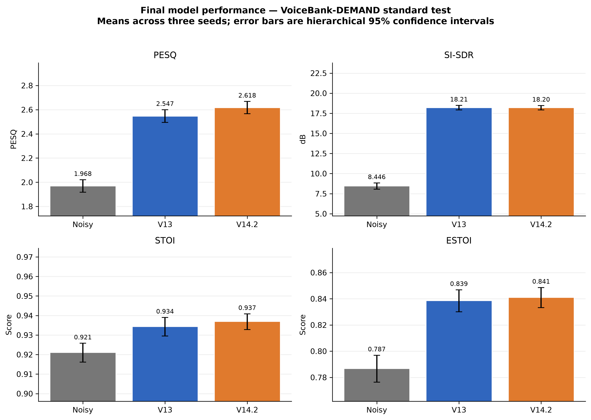

# A Sub-Million-Parameter Causal Speech Enhancement Model with GRU Temporal Modelling and Privileged Distillation

Research repository for a lightweight, strictly causal speech-enhancement
system. The project began with noise-state vector quantisation and Mamba-based
models, but the evidence-led final design is a simpler GRU model trained with
privileged distillation.

> **Research status:** model development was frozen on **27 July 2026**.
> **V14.2 (`CN-VQG-GRU-T1-PD`)** is the final deployable dissertation model.
> Later V15–V18 preservation controllers are reported as ablations and negative
> results; none replaces V14.2.

## Final outcome

V14.2 is a sub-million-parameter causal model that operates on 16 kHz audio
with 20 ms algorithmic latency. It has the same inference graph as the
supervised V13 reference; its non-causal teacher and clean-reference confidence
calculation are used only during training.

| Property | Final value |
|---|---:|
| Parameters | 808,095 |
| Analysis window / hop | 20 ms / 10 ms |
| Algorithmic latency | 20 ms |
| Temporal core | One 232-dimensional GRU |
| Reconstruction | Scalar magnitude mask with noisy phase |
| Noise representation | Continuous four-frame causal context |
| Deployment checkpoint | V14.2 seed 1200, epoch 3 |
| Replication seeds | 1200, 1201, 1202 |
| Teacher required at inference | No |

The central result is that confidence-weighted privileged distillation improved
perceptual quality and intelligibility on the standard evaluation without
adding parameters, state, look-ahead, or runtime cost. The PESQ benefit also
transferred to an independently sourced DNS1 condition. Cross-domain STOI
preservation remains unresolved.

## Results

All values below are frozen three-seed means. Confidence intervals are 95%
hierarchical-bootstrap intervals over training seed and utterance.

### VoiceBank-DEMAND standard comparability test

The standard test contains 824 utterances per seed.

| System | PESQ | SI-SDR (dB) | STOI | ESTOI |
|---|---:|---:|---:|---:|
| Noisy input | 1.968 | 8.446 | 0.9211 | 0.7867 |
| V13 supervised reference | 2.547 | **18.213** | 0.9343 | 0.8386 |
| **V14.2 privileged-distilled** | **2.618** | 18.202 | **0.9369** | **0.8410** |

Paired V14.2-minus-V13 effects:

| Metric | Mean difference | 95% CI | Win rate |
|---|---:|---:|---:|
| PESQ | **+0.07069** | **[+0.05828, +0.08260]** | 66.5% |
| SI-SDR | -0.01157 dB | [-0.08164, +0.06566] | 46.0% |
| STOI | **+0.002614** | **[+0.000822, +0.004773]** | 58.8% |
| ESTOI | **+0.002414** | **[+0.000317, +0.005628]** | 59.3% |

PESQ, STOI, and ESTOI improved with intervals excluding zero. The SI-SDR
difference is statistically neutral; both final systems improve SI-SDR by
approximately 9.76 dB over the noisy input.



### Independent DNS1 external evaluation

The external set contains 150 paired utterances per seed from the Microsoft
DNS Challenge 1 synthetic no-reverberation condition.

| System | PESQ | SI-SDR (dB) | STOI | ESTOI |
|---|---:|---:|---:|---:|
| Noisy input | 1.582 | 9.230 | **0.9152** | 0.8099 |
| V13 supervised reference | 1.783 | 11.447 | 0.8984 | 0.8167 |
| **V14.2 privileged-distilled** | **1.842** | **11.576** | 0.9053 | **0.8236** |

The paired V14.2 PESQ gain over V13 is **+0.05946**, with a 95% CI of
**[+0.01214, +0.11677]** and a 73.3% win rate. SI-SDR, STOI, and ESTOI point
estimates favour V14.2 over V13, but their intervals cross zero.

The main limitation is explicit: V14.2's mean DNS1 STOI (0.9053) remains below
the unprocessed noisy input (0.9152). The external experiment therefore
supports transferred perceptual-quality improvement, not universal
intelligibility preservation or broad cross-domain harmlessness.

### Real-time CPU performance

The native seed-1200 streamer was measured with one thread on an AMD Ryzen 7
7800X3D:

| Measurement | V14.2 |
|---|---:|
| Streaming real-time factor | 0.372 |
| p95 frame time | 4.077 ms |
| p99 frame time | 4.184 ms |
| Hop deadline | 10 ms |
| Persistent FP32 state | 0.119 MiB |

Both p95 and p99 frame times meet the 10 ms hop deadline on the tested
processor. This is evidence for that CPU and benchmark protocol, not a measured
claim about phones, embedded processors, or other hardware.

## Final architecture

The deployed signal path is:

```text
16 kHz noisy waveform
  -> uncentred causal STFT (FFT 512, Hann window 320, hop 160)
  -> magnitude and noisy-phase features
  -> local causal encoder with one frequency downsample
  -> continuous four-frame noise context and bounded modulation
  -> one 232-dimensional GRU temporal block
  -> full-resolution skip and scalar magnitude-mask decoder
  -> noisy-phase reconstruction and causal overlap-add
  -> enhanced waveform
```

The mask is bounded to `(0, 2)` and identity-initialised at `1`. Offline
inference batches complete utterances but remains causal; native streaming
retains constant-sized analysis, noise-context, GRU, and overlap-add state.

Despite the historical repository name and implementation filename, the final
inference path uses **no vector quantiser and no Mamba block**. It also uses no
attention, phase correction, residual preservation gate, or privileged teacher
at inference. See the
[model-version and architecture handover](docs/thesis/model_version.md)
for the mapping between research labels, checkpoint aliases, and source files.

## What the later controller study found

V15–V18 investigated whether a causal, input-dependent residual-strength
controller could avoid intelligibility harm. These are development studies,
not final test-set promotions.

- Causal statistics and burn-in-aware supervision substantially improved the
  controller over the initial formulation.
- V17 Recipe 7a was the best balanced candidate, with an avoidable-violation
  rate of 0.204. It missed the frozen maximum of 0.20 by three cases among 549
  feasible contexts.
- V18 Recipe 8 improved full-route accuracy but reached only 0.250 reduced-route
  macro accuracy, below the frozen 0.30 minimum, while avoidable violations
  increased to 0.211.
- No controller cleared the predeclared promotion gate. V14.2 therefore
  remained the final model.

This negative result suggests that target separability and causal decision
uncertainty, rather than optimisation time alone, limited reliable
per-utterance strength selection.

## Data and evaluation policy

The main dataset is paired VoiceBank-DEMAND. The final programme used:

| Partition | Role | Utterances |
|---|---|---:|
| Training | Parameter optimisation | 10,235 |
| Epoch selection | V13 diagnostics and early stopping | 100 |
| Architecture selection | Candidate comparison | 400 |
| Internal reserve | Frozen V13 confirmation | 437 |
| Standard test | Benchmark comparability | 824 |
| DNS1 external | Independent external evaluation | 150 |

The standard VoiceBank-DEMAND test was reused during the wider exploratory
programme. It is therefore reported as a standard comparability test, not a
project-wide pristine holdout. DNS1 was frozen before final V14.2 evaluation,
but it represents one synthetic no-reverberation condition rather than all
real recordings, devices, reverberation, or noise domains.

Final quality evaluation uses full utterances and reports PESQ, SI-SDR, STOI,
and ESTOI. Three independent seeds are aggregated with hierarchical bootstrap;
V14.2-versus-V13 comparisons use a paired hierarchical bootstrap.

## Reproducing and auditing the project

The code targets Python 3.11. The recorded final environment used PyTorch
2.11.0+cu128; quality evaluation used CUDA, while the deployment timing result
used one CPU thread.

Create the base environment and install the package in editable mode:

```bash
conda env create -f environment.yml
conda activate cnvqg

# Install a PyTorch/torchaudio build suitable for your platform first.
python -m pip install -e .
```

`requirements-lock.txt` records the exact final Linux/CUDA environment.
`requirements-optional.txt` documents the historical Mamba dependencies, which
are not required by the final GRU inference graph.

The final local research bundle includes datasets, checkpoints, and generated
results that are intentionally excluded from Git because of their size. With
that bundle present, verify all 39 frozen artefacts, hashes, and headline
claims:

```bash
python scripts/verify_final_research_freeze.py
```

Expected output:

```text
Research freeze verified: 39 artifacts, all hashes and claims match.
```

The canonical deployment checkpoint in the local artefact bundle is:

```text
checkpoints/v14/distillation/mag_005/epoch_003.pt
```

The preserved evaluation protocol is
[`configs/v14/frozen_replication_evaluation.yaml`](configs/v14/frozen_replication_evaluation.yaml).
It fixes raw model weights, full-utterance evaluation, seeds 1200–1202, and
epoch 3 for every V14.2 replication. New architecture, loss, recipe, epoch,
checkpoint, controller, or test-set selection is outside the frozen final
claim.

## Repository map

```text
configs/                 Frozen protocols and experiment configurations
data/                    Local datasets and metadata (contents ignored by Git)
src/cnvqg/               Models, losses, metrics, data, and streaming code
scripts/                 Training, evaluation, analysis, and audit tools
docs/results/            Frozen decisions and experiment reports
docs/thesis/             Implementation-traced methods and results drafts
docs/figures/thesis/     Dissertation figures and provenance
results/                 Local generated evidence (ignored by Git)
checkpoints/             Local model weights (ignored by Git)
```

Start with these authoritative records:

1. [Final research freeze](docs/results/final_research_freeze.md)
3. [Results chapter](docs/thesis/results_chapter_draft.md)
4. [Model-version and architecture handover](docs/thesis/model_version.md)
5. [Figure provenance and evidence policy](docs/figures/thesis/README.md)

Older files whose names contain “final” may describe superseded historical
stages. The 27 July 2026 research freeze is the authoritative project outcome.
