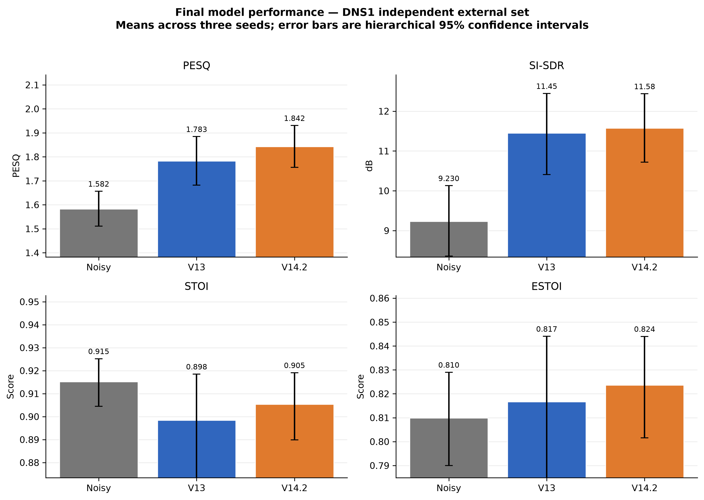
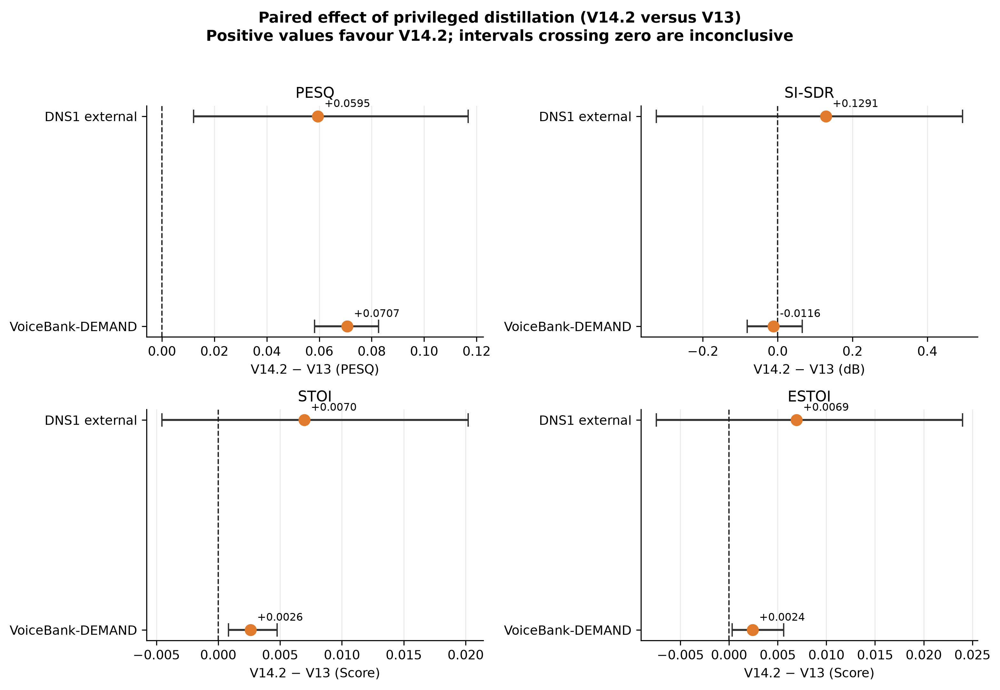
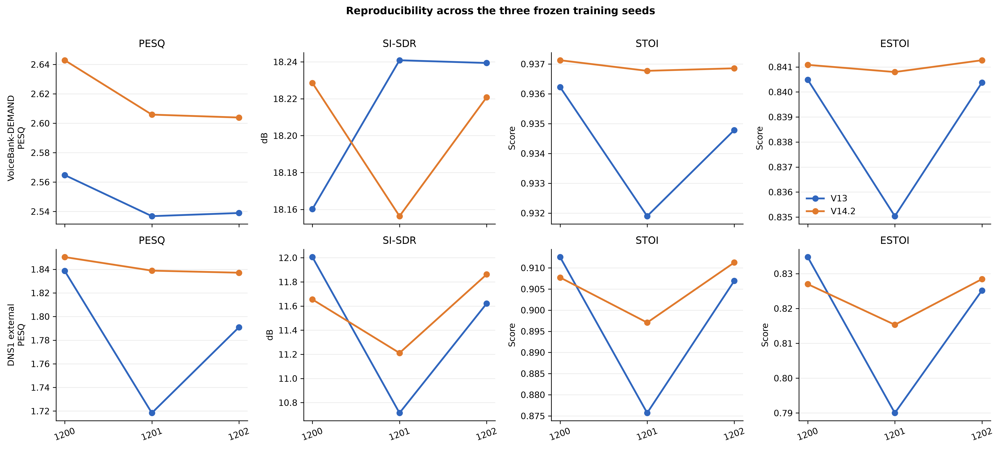
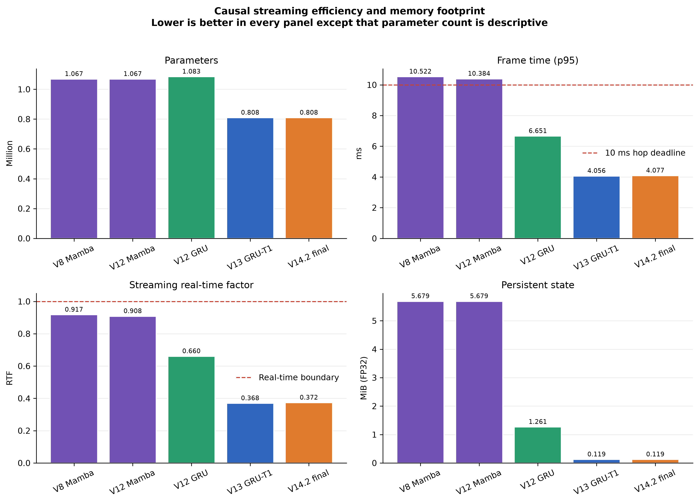
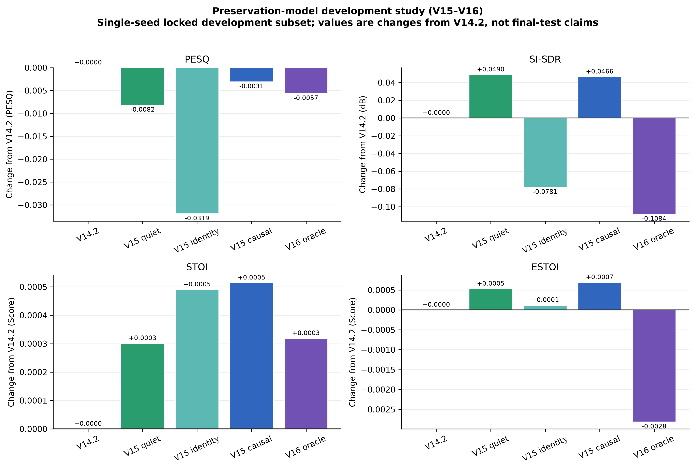
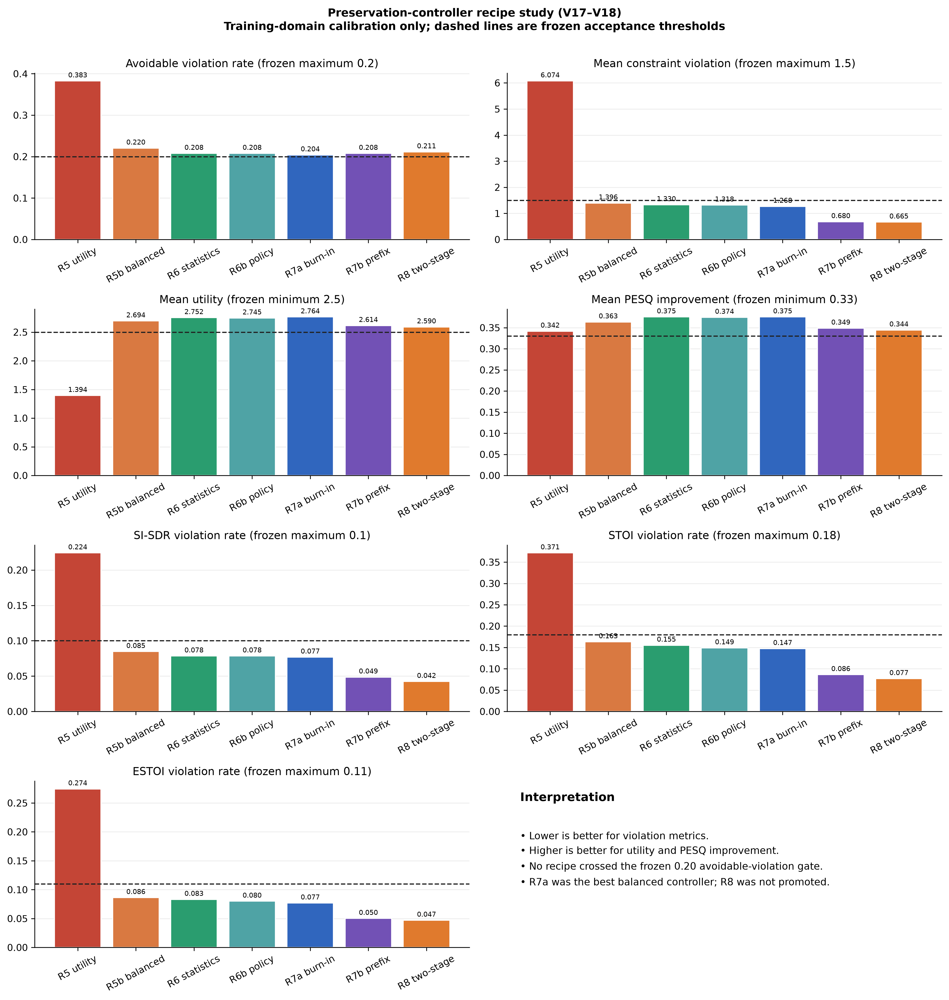
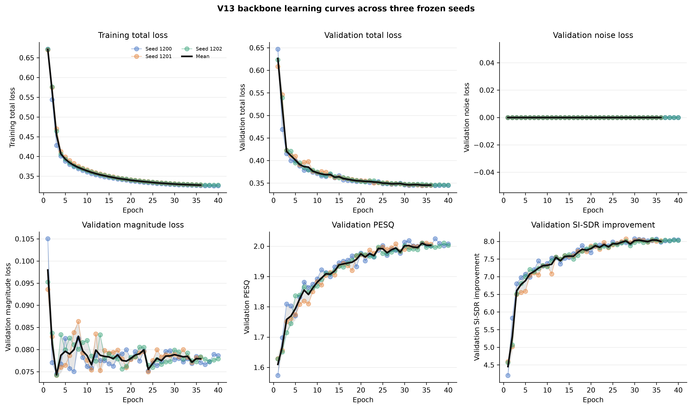
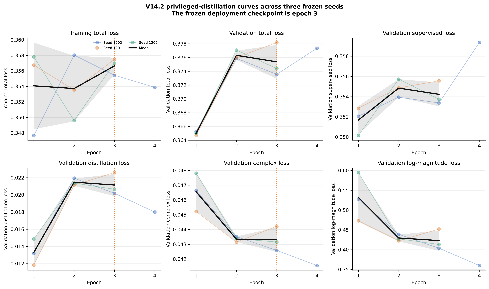
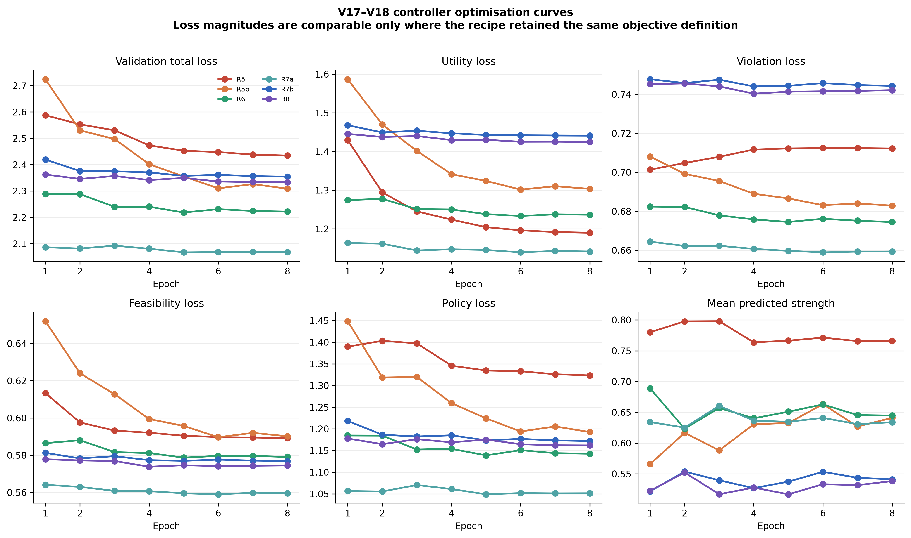
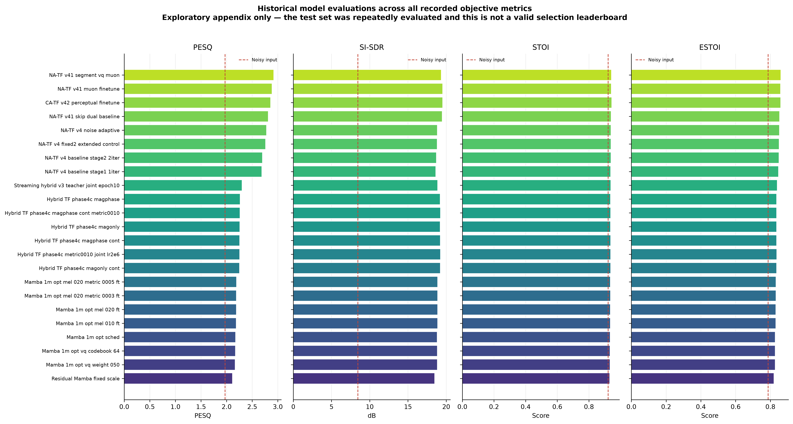

# Results chapter draft

> Writing status: evidence-complete draft. Replace the provisional chapter and
> figure numbers after integrating this text into the dissertation template.
> Numerical claims are frozen and traceable through
> [`figure_provenance.csv`](../figures/thesis/figure_provenance.csv).

## 1. Evaluation and reporting policy

The final comparison concerns two causal real-time systems. V13
(`CN-VQG-GRU-T1`) is the selected 808,095-parameter temporal-core model. V14.2
(`CN-VQG-GRU-T1-PD`) retains the same deployable architecture but is trained
using privileged distillation. Consequently, any quality difference between
V13 and V14.2 is attributable to the training procedure rather than additional
inference-time capacity.

Three independently trained seeds (1200, 1201, and 1202) were evaluated for
each model. Aggregate uncertainty was estimated by hierarchical bootstrap over
both training seed and utterance. Direct V14.2-versus-V13 effects were estimated
with a paired hierarchical bootstrap, preserving the correspondence between
model seed and evaluation utterance. The reported intervals are 95% confidence
intervals.

Two evaluation scopes are kept distinct:

1. The VoiceBank-DEMAND standard test set contains 824 utterances per seed and
   provides comparability with earlier experiments. Because this test set was
   evaluated repeatedly during the wider research programme, it is not treated
   as a pristine source of model-selection evidence.
2. The DNS1 external set contains 150 utterances per seed and provides an
   independent cross-domain evaluation of the frozen V14.2 model.

The V15–V18 preservation experiments are reported as development studies. They
were not promoted into the final model and must not be combined with the final
test results as though they were evaluated under one selection protocol.

## 2. Final VoiceBank-DEMAND performance

Table 1 reports the absolute three-seed means on the standard VoiceBank-DEMAND
test set. Relative to the noisy signal, V14.2 increased PESQ from 1.968 to 2.618
and SI-SDR from 8.446 dB to 18.202 dB. It also increased STOI from 0.9211 to
0.9369 and ESTOI from 0.7867 to 0.8410. The resulting SI-SDR improvement was
9.756 dB.

**Table 1. Three-seed mean performance on the VoiceBank-DEMAND standard test
set (824 utterances per seed).**

| System | PESQ | SI-SDR (dB) | SI-SDR improvement (dB) | STOI | ESTOI |
|---|---:|---:|---:|---:|---:|
| Noisy input | 1.968 | 8.446 | — | 0.9211 | 0.7867 |
| V13 | 2.547 | 18.213 | 9.768 | 0.9343 | 0.8386 |
| **V14.2** | **2.618** | 18.202 | 9.756 | **0.9369** | **0.8410** |

The paired analysis in Table 2 gives the more appropriate estimate of the
effect of privileged distillation. V14.2 improved PESQ by 0.0707
(95% CI 0.0583 to 0.0826), STOI by 0.00261 (95% CI 0.00082 to 0.00477), and
ESTOI by 0.00241 (95% CI 0.00032 to 0.00563). All three intervals exclude zero.
The PESQ utterance-level win rate was 66.5%.

The SI-SDR difference was -0.0116 dB (95% CI -0.0816 to 0.0657). This interval
contains zero and is narrow relative to the approximately 9.76 dB improvement
over the noisy input. The result therefore supports a statistically neutral
SI-SDR interpretation: privileged distillation improved perceptual quality and
intelligibility without evidence of a meaningful distortion penalty.

**Table 2. Paired V14.2-minus-V13 effects on VoiceBank-DEMAND.**

| Metric | Mean difference | 95% CI | Paired win rate |
|---|---:|---:|---:|
| PESQ | **+0.07069** | **[+0.05828, +0.08260]** | 66.5% |
| SI-SDR | -0.01157 dB | [-0.08164, +0.06566] | 46.0% |
| STOI | **+0.002614** | **[+0.000822, +0.004773]** | 58.8% |
| ESTOI | **+0.002414** | **[+0.000317, +0.005628]** | 59.3% |

**Figure 1.** Absolute performance of the noisy input, V13, and V14.2 on the
VoiceBank-DEMAND standard test set. Bars show means across three training seeds;
error bars show hierarchical 95% confidence intervals. The truncated axes are
used to expose the model-to-model differences and should not be interpreted as
zero-based effect sizes.

## 3. Independent DNS1 external evaluation

The external evaluation was more difficult than the matched standard test.
Absolute scores were lower for both models and variability between V13 seeds
was larger. Nevertheless, V14.2 achieved the strongest mean result for every
enhanced-speech metric in Table 3.

**Table 3. Three-seed mean performance on the DNS1 external set
(150 utterances per seed).**

| System | PESQ | SI-SDR (dB) | SI-SDR improvement (dB) | STOI | ESTOI |
|---|---:|---:|---:|---:|---:|
| Noisy input | 1.582 | 9.230 | — | **0.9152** | 0.8099 |
| V13 | 1.783 | 11.447 | 2.217 | 0.8984 | 0.8167 |
| **V14.2** | **1.842** | **11.576** | **2.346** | 0.9053 | **0.8236** |

The paired PESQ gain of 0.0595 had a 95% confidence interval of 0.0121 to
0.1168 and a win rate of 73.3%, providing evidence that the perceptual-quality
benefit transferred beyond the training domain. The SI-SDR, STOI, and ESTOI
point estimates also favoured V14.2, but their confidence intervals crossed
zero (Table 4). These metrics should therefore be described as directionally
positive rather than statistically established external gains.

**Table 4. Paired V14.2-minus-V13 effects on DNS1.**

| Metric | Mean difference | 95% CI | Paired win rate |
|---|---:|---:|---:|
| PESQ | **+0.05946** | **[+0.01214, +0.11677]** | 73.3% |
| SI-SDR | +0.12910 dB | [-0.32431, +0.49392] | 52.4% |
| STOI | +0.006959 | [-0.004551, +0.020196] | 61.8% |
| ESTOI | +0.006935 | [-0.007472, +0.023978] | 58.0% |

The main cross-domain limitation is visible in STOI. V14.2 improved STOI over
V13 (0.9053 versus 0.8984), but its mean remained below the unprocessed noisy
input (0.9152). PESQ, SI-SDR, and ESTOI all improved over the noisy input.
Accordingly, the external result supports improved quality and distortion
reduction but not universal intelligibility preservation.

**Figure 2.** Absolute performance on the independent DNS1 external set. Bars
show three-seed means and hierarchical 95% confidence intervals. The noisy
STOI result is retained to make the remaining cross-domain intelligibility
limitation explicit.

**Figure 3.** Paired V14.2-minus-V13 effects on the standard and external
evaluation sets. Positive values favour V14.2. Error bars are paired
hierarchical 95% confidence intervals; intervals crossing zero are treated as
inconclusive.

## 4. Reproducibility across training seeds

V14.2 was stable on the standard test set. Across its three seeds, the standard
deviations were 0.0219 for PESQ, 0.0397 dB for SI-SDR, 0.00019 for STOI, and
0.00024 for ESTOI. In particular, the V14.2 STOI and ESTOI seed variability was
substantially smaller than for V13 (0.00220 and 0.00312, respectively).

On DNS1, V14.2 also reduced seed variability relative to V13 for all four
metrics. PESQ standard deviation decreased from 0.0605 to 0.0072, SI-SDR from
0.663 to 0.332 dB, STOI from 0.0199 to 0.0074, and ESTOI from 0.0236 to 0.0072.
Although only three seeds are available, this pattern suggests that privileged
distillation improved optimisation consistency as well as the mean perceptual
result.

**Figure 4.** Per-seed V13 and V14.2 performance on VoiceBank-DEMAND and DNS1.
Each point is the aggregate score for one independently trained seed. The plot
is descriptive because three seeds provide limited power for distributional
claims.

## 5. Real-time deployment efficiency

V14.2 has 808,095 parameters and an algorithmic latency of 20 ms. On an AMD
Ryzen 7 7800X3D using one CPU thread, its measured p95 and p99 frame times were
4.077 ms and 4.184 ms, respectively, against a 10 ms hop deadline. Its
streaming real-time factor was 0.372, and its persistent FP32 state occupied
0.119 MiB. It therefore met both the p95 and p99 real-time deadlines with
substantial margin.

Because V13 and V14.2 share the same inference architecture, privileged
distillation introduced no parameter or state-memory overhead. Their measured
runtime difference was negligible: V13 had a p95 frame time of 4.056 ms and an
RTF of 0.368. By contrast, the earlier V8 Mamba system had 1.067 million
parameters, a p95 frame time of 10.522 ms, an RTF of 0.917, and 5.679 MiB of
persistent state. The temporal-core redesign therefore reduced both runtime
and state memory while retaining causal 20 ms operation.

**Figure 5.** Single-thread CPU streaming efficiency. Lower values are better
for frame time, real-time factor, and persistent state. The V12 structural
entries isolate architectural cost and do not represent quality evaluations.
All entries use 20 ms algorithmic latency.

## 6. Preservation-model development study

V15 and V16 investigated whether an input-dependent residual controller could
preserve intelligibility under conditions where full enhancement was harmful.
These experiments used a single-seed locked 400-utterance development subset
and are therefore reported as ablations rather than final evidence.

**Table 5. Preservation-model results on the locked VoiceBank development
subset.**

| Development system | PESQ | SI-SDR (dB) | STOI | ESTOI |
|---|---:|---:|---:|---:|
| V14.2 reference | **2.1576** | 14.4334 | 0.88773 | 0.76691 |
| V15 quiet-level gate | 2.1495 | **14.4824** | 0.88803 | 0.76744 |
| V15 identity target | 2.1257 | 14.3552 | 0.88822 | 0.76703 |
| V15 causal preservation | 2.1546 | 14.4800 | **0.88824** | **0.76760** |
| V16 oracle residual gate | 2.1520 | 14.3250 | 0.88805 | 0.76410 |

The V15 causal preservation gate produced the strongest STOI and ESTOI means
while remaining close to the V14.2 PESQ score. However, the absolute changes
were small, only one training seed was used, and V16 did not improve the
balance. These results justified studying the controller’s decision problem,
but not replacing V14.2.

**Figure 6.** V15–V16 preservation results on the locked development subset,
shown as changes from V14.2. These are single-seed development comparisons and
must not be presented as final test-set gains.

## 7. Controller recipes and negative results

The V17–V18 programme reframed preservation as constrained strength selection.
The frozen acceptance criteria required an avoidable-violation rate no greater
than 0.20 while maintaining minimum utility, PESQ improvement, and routing
accuracy and maximum per-metric violation rates. All results in this section
come from the 638-item training-domain calibration set; neither the development
set nor the external test set was used to promote Recipe 8.

Recipe 5 exposed severe class collapse. Its selected controller achieved only
two of nine checks, with an avoidable-violation rate of 0.383 and a mean
constraint violation of 6.074. Rebalancing and causal statistics produced a
large improvement: Recipe 6 passed eight of nine checks and reduced avoidable
violations to 0.208.

Recipe 7a, which introduced burn-in-aware supervision, was the best balanced
candidate. It reduced the avoidable-violation rate to 0.204 while retaining a
mean utility of 2.764 and mean PESQ improvement of 0.375. It missed the frozen
limit by three avoidable cases among 549 feasible contexts. Recipe 7b reduced
the severity of violations and the SI-SDR, STOI, and ESTOI violation rates, but
did not reduce the avoidable-violation frequency.

Recipe 8 factorised routing into a full-versus-reduced decision followed by a
conditional reduced-strength selector. It improved full-route accuracy to
0.807 and met the reduced-route recall threshold at 0.750. However, reduced
macro accuracy was only 0.250, below the frozen minimum of 0.30, and the
avoidable-violation rate increased to 0.211. Recipe 8 passed 10 of 12 checks
but failed both decisive routing checks and was not promoted.

The preservation study therefore supports three conclusions:

1. Causal statistics and burn-in-aware supervision materially improved safety
   over the initial utility controller.
2. Prefix-aligned and two-stage targets reduced violation severity and improved
   routing behaviour, but did not cross the predeclared avoidable-violation
   threshold.
3. Further controller training on the current target construction was not
   justified within the frozen research protocol. V14.2 remained the final
   deployable model, while Recipe 7a remained the best balanced development
   candidate.

**Figure 7.** Selected V17–V18 controller outcomes on the training-domain
calibration set. Dashed lines show the frozen acceptance thresholds. Lower is
better for violation metrics; higher is better for utility and PESQ
improvement. No recipe crossed the avoidable-violation gate.

## 8. Optimisation behaviour

The V13 backbone showed consistent learning across all three seeds. Training
and validation losses decreased while validation PESQ and SI-SDR improvement
increased. This provides a useful optimisation check but does not replace the
final full-set evaluation because the validation perceptual metrics were
computed during training.

**Figure 8.** V13 backbone training, validation, and validation-perceptual
curves for seeds 1200–1202. Thin coloured lines are individual seeds; the black
line is the across-seed mean and the shaded region is one seed standard
deviation.

The V14.2 distillation stage was deliberately short. The complex and
log-magnitude components decreased sharply between epochs 1 and 2, after which
the aggregate validation loss flattened. Epoch 3 was fixed as the deployment
checkpoint for all three seeds. Seed 1200’s fourth epoch is shown only as a
diagnostic continuation and was not used to revise the frozen selection.

**Figure 9.** V14.2 privileged-distillation curves across three seeds. The
vertical dotted line marks the frozen epoch-3 checkpoint. The black curve and
shading are computed only over epochs shared by all seeds.

The controller optimisation curves show that lower training losses alone did
not guarantee compliance with the downstream constraints. Later recipes
reduced utility, violation, feasibility, and policy losses relative to Recipe
5, but the selected Recipe 7 and Recipe 8 controllers still missed the frozen
avoidable-violation threshold. This discrepancy motivates reporting both
optimisation curves and decision-level gate outcomes.

**Figure 10.** V17–V18 controller validation losses and mean predicted
strength. Curves are compared only where the corresponding objective retained
the same interpretation; their absolute magnitudes are not final quality
metrics.

## 9. Historical experiments

The earlier programme explored Mamba scaling, magnitude and phase objectives,
streaming hybrid teachers, and noise-adaptive time-frequency architectures.
These experiments were important for narrowing the design space, but many were
evaluated repeatedly on the standard test set. Their scores are therefore
presented only as an appendix-level historical overview and not as a formal
leaderboard or evidence that the highest exploratory score would generalise.

**Figure 11.** Historical objective scores for all 23 models with recorded
full-test summaries. This figure documents the experimental trajectory. It is
not a valid model-selection ranking because the test set was reused during the
early exploratory programme.

## 10. Results summary

The final results support V14.2 as the dissertation model. On the standard
VoiceBank-DEMAND evaluation, privileged distillation produced statistically
supported gains in PESQ, STOI, and ESTOI while leaving SI-SDR statistically
neutral. On the independent DNS1 evaluation, the PESQ gain transferred and the
remaining point estimates favoured V14.2, although their confidence intervals
were inconclusive. V14.2 retained the 808,095-parameter, 20 ms causal
architecture and operated comfortably in real time on a single CPU thread.

The preservation programme did not justify replacing V14.2. It identified
useful causal supervision mechanisms and reduced several violation measures,
but no V17–V18 recipe satisfied the predeclared avoidable-violation gate. This
negative result is informative: the remaining limitation appears to be target
separability and decision uncertainty rather than insufficient optimisation
time alone.

The final claim should therefore remain deliberately bounded:

> Privileged distillation improved the perceptual quality and intelligibility
> of the selected causal real-time model without increasing inference cost or
> producing evidence of an SI-SDR penalty on the standard evaluation. The PESQ
> benefit transferred to an independent external set, while cross-domain STOI
> preservation and reliable causal strength selection remained unresolved.

## Source map

| Evidence | Frozen source |
|---|---|
| Standard absolute metrics | `results/v14/replication_evaluation/standard/{v13,v14_2}_aggregate.json` |
| Standard paired effects | `results/v14/replication_evaluation/standard/v14_2_vs_v13_paired_hierarchical.json` |
| External absolute metrics | `results/v14/replication_evaluation/external/{v13,v14_2}_aggregate.json` |
| External paired effects | `results/v14/replication_evaluation/external/v14_2_vs_v13_paired_hierarchical.json` |
| Runtime | `results/runtime/{v13_final_gru_seed1200_cpu,v14_2_distilled_seed1200_cpu}.json` |
| Preservation study | `results/v15/preservation/**` and `results/v16/oracle_gate_seed16040/**` |
| Recipe 7 conclusion | `results/v17/recipe7_conclusion.json` |
| Recipe 8 conclusion | `results/v18/recipe8_conclusion.json` |
| Research policy | `results/final_research_freeze/manifest.json` |
